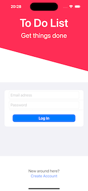
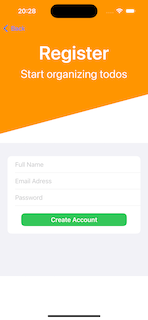
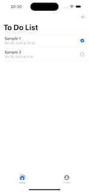
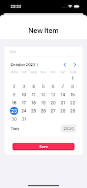
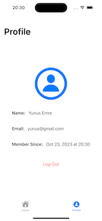

# ToDoApp

## Built With

- [Swift](https://developer.apple.com/swift/)
- [SwiftUI](https://developer.apple.com/xcode/swiftui/)
- [Firebase](https://firebase.google.com)

    
    
    
    
    

